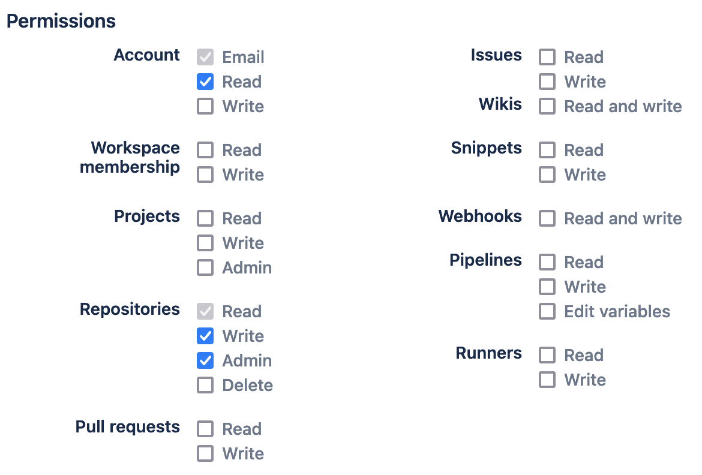

Mirrors a GitHub Git repository to Bitbucket. If no corresponding Bitbucket repository exists, it is created using the [Bitbucket API 2.0](https://developer.atlassian.com/bitbucket/api/2/reference/).

**Please note**: make sure that you checkout the entire repository before using this. By default, `actions/checkout@v2` only creates a shallow clone. See section [example usage](#example-usage) on how to do a complete clone.

## Required Inputs

### `api-token` (Recommended)
Bitbucket API token for authentication and pushing. **As of September 9, 2025, app passwords can no longer be created, and existing app passwords will become inactive on June 9, 2026.**

**To create an API token:**
1. Go to your Bitbucket account settings
2. Navigate to Personal settings > API tokens
3. Create a new token with the following permissions:
   - **Repositories**: Read, Write, Admin

For more information, see [Bitbucket's API token documentation](https://support.atlassian.com/bitbucket-cloud/docs/using-api-tokens/).

### `password` (Deprecated)
App password for authentication (deprecated). **Use `api-token` instead.** This parameter is maintained for backward compatibility but will be removed in a future version.

If you still need to use an app password, create a new [App Password](https://bitbucket.org/account/settings/app-passwords/) with the following permissions:




## Optional Inputs
### `username`
Username to use on Bitbucket for 1) authentication and as 2) workspace name. Default: GitHub user name.

### `repository`
Name of the repository on Bitbucket. If it does not exist, it is created automatically. Default: GitHub repository name.

### `spacename`
Name of the space in which the repository should be contained on Bitbucket. Default:  GitHub user name.

## Outputs
None


## Example usage

      - name: Checkout
        uses: actions/checkout@v4
        with:
          fetch-depth: 0 # <-- clone with complete history
      - name: Push
        uses: AndrewScott-Ingram/mirror-to-bitbucket-github-action@v3
        with:
          api-token: ${{ secrets.BITBUCKET_API_TOKEN }}

## Example with all parameters

      - name: Checkout
        uses: actions/checkout@v4
        with:
          fetch-depth: 0 # <-- clone with complete history
      - name: Push
        uses: AndrewScott-Ingram/mirror-to-bitbucket-github-action@v3
        with:
          username: mycrazybbusername
          spacename: teamspace
          repository: bestrepo
          api-token: ${{ secrets.BITBUCKET_API_TOKEN }}

## Migration from v2 to v3

If you're upgrading from v2, you need to:

1. Create a Bitbucket API token (see instructions above)
2. Store the token as a GitHub secret (e.g., `BITBUCKET_API_TOKEN`)
3. Update your workflow to use `api-token` instead of `password`:

```yaml
# Before (v2)
- uses: AndrewScott-Ingram/mirror-to-bitbucket-github-action@v2
  with:
    password: ${{ secrets.BITBUCKET_PASSWORD }}

# After (v3)
- uses: AndrewScott-Ingram/mirror-to-bitbucket-github-action@v3
  with:
    api-token: ${{ secrets.BITBUCKET_API_TOKEN }}
```

Note: v3 still supports the `password` parameter for backward compatibility, but it will be removed in a future version.
